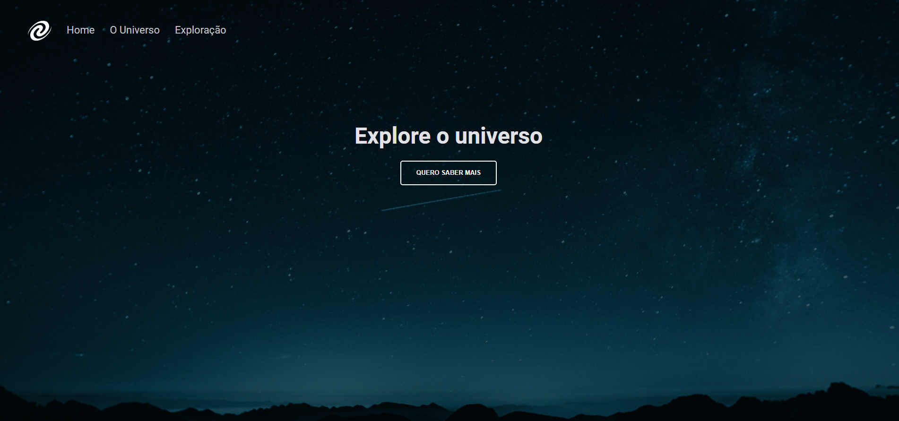

# 🚀 Trilha Explorer

> Desafio proposto durante o curso explorer, onde foi abordado e utilizado os:
>> Conceitos de SPA;
>> Mapeamento de rotas;
>> Assíncrono e promises;
>> Orientação a objetos;
>> Classes e muito mais.

[🔗Click to acess](https://rodkunz.github.io/spa-universe/)

# 🔨 Funcionalidades do projeto

`Funcionalidade 1`: Clicar no botão ele irá se redirecionar para a page O Universo.

`Funcionalidade 2`: Navegar entre páginas utilizando as navegações acima.

## 🛠 Tecnologias utilizadas

- HTML
- CSS
- JavaScript
- Node.js
- Git e Github

## 💻 Contatos

raokrodrigo@gmail.com